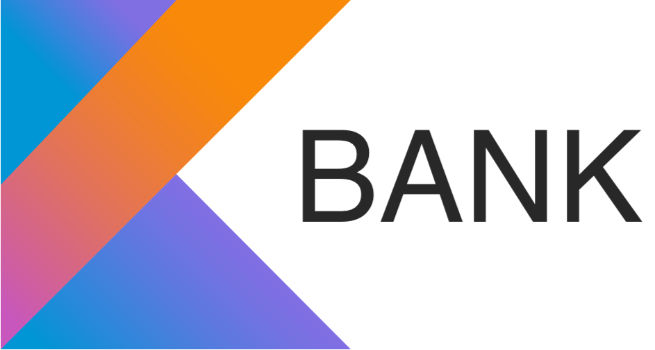

# Kotlin Bank
Banking software written in Kotlin. Built using CQRS and EventSourcing patterns.

The purpose is to illustrate patterns how to achieve a number of patterns. This application implements:
- EventSourcing to write and project Aggregate states
- Sagas, to multi-aggregate transactions
- Asynchronous Commands
- Write models, enforcing business variants
- Read models, using Document/object storage
- Stream programming

It also explores a few Kotlin features for fun :)!

## Dependencies
There are only two dependencies outside of this project. MongoDB and EventStoreDB.

### Starting MongoDB with Docker
```
docker run --name some-mongo -p "27017:27017" mongo:latest
```

### Starting EventStoreDB with Docker
```
docker run -it -p 2113:2113 -p 1113:1113 \
    ghcr.io/eventstore/eventstore:20.6.1-alpha.0.69-arm64v8 --insecure --run-projections=All \
    --enable-external-tcp --enable-atom-pub-over-http
```

### Setting Up Server
#### Persistent Subscriptions
There is only one persistent subscription required for the application to work. It's responsible for allowing competing
consumers for Commands. 

Go to `Persistent Subscriptions` in the EventStoreDB UI and add the following Persistent Subscription:
- `Group` -> `command-handler-group`
- `Stream` -> `commands`

#### User-Defined/System Projections
The application uses no system or user-defined projections. However, here is an example of a User-Defined projection that you can use
to build a report of the running system. This is entirely optional. 

It provides a simple report on:
- Volume of active accounts
- Blocked accounts
- Monetary volume of deposits and withdrawals
- Volume of successful and failed transactions
- Monetary volume of successful transactions

```javascript
fromAll().when({
    $init: () => ({ 
        openAccounts: 0,
        blockedAccounts: 0,
        withdrawAmount: 0,
        depositAmount: 0,
        successfulTransactionAmount: 0,
        numSuccessfulTransactions: 0,
        numFailedTransactions: 0,
        transactions: {}
    }),

    "events.AccountCreated": (s,e) => {
        s.openAccounts++;
    },
    
    "events.AccountClosed": (s,e) => {
        s.openAccounts--;
    },
    
    "events.AccountBlocked": (s,e) => {
        s.blockedAccounts++;
    },
    
    "events.FundsWithdrawn": (s,e) => {
        if(e.streamId.includes("saga-")) { return }
        
        s.withdrawAmount += e.data.amount;
    },
    
    "events.FundsDeposited": (s,e) => {
        if(e.streamId.includes("saga-")) { return }
        
        s.depositAmount += e.data.amount;
    },
    
    "events.TransactionRequested": (s,e) => {
        if(e.streamId.includes("saga-")) { return }
        
        s.transactions[e.data.uuid] = {"uuid": e.data.uuid, "amount": e.data.amount, "correlation_id": e.data.correlationId};
    },
    
    "events.TransactionCompleted": (s,e) => {
        if(e.streamId.includes("saga-")) { return }
        
        s.successfulTransactionAmount += s.transactions[e.data.uuid].amount;
        s.numSuccessfulTransactions += 1;
    },
    
     "events.TransactionFailed": (s,e) => {
        if(e.streamId.includes("saga-")) { return }
        
        s.numFailedTransactions += 1;
    }
    
}).transformBy((s) => ({
    'Total active accounts': s.openAccounts,
    'Total block accounts (active and inactive)': s.blockedAccounts,
    'Total withdrawal volume': s.withdrawAmount,
    'Total deposit volume': s.depositAmount,
    'Montery volume of successful transaction': s.successfulTransactionAmount,
    'Count of successful transaction': s.numSuccessfulTransactions,
    'Count of failed transaction': s.numFailedTransactions
})).outputState();
```

You can either run this using the `Queries` tab or create a User-Defined projection.

The benefit of using a User-Defined projection is that you can continuously update the report
at the expense of write-time efficiency.

## GraphQL & RESTful APIs

All commands/mutations and queries can be found in the postman collection.

The RESTful API accepts JSON and returns JSON.

The GraphQL uses typical GQL.

### Mutations/Commands

#### Open Account
Opens a simple account. Returns the new account UUID.

##### REST
```
POST /accounts
```

##### GraphQL
```
mutation {
    OpenAccount {
        accepted
        uuid
    }
}
```

#### Block Account
Blocks the account. Blocked accounts cannot withdrawal funds but can deposit/receive funds.
##### REST
```
POST /accounts/{account_uuid}/block
```

##### GraphQL
```
mutation ($uuid: String!) {
    BlockAccount(uuid: $uuid) {
        accepted
    }
}
```

#### Unblock Account
Unblocks the account. The account may continue withdrawing funds.

##### REST
```
POST /accounts/{account_uuid}/unblock
```

##### GraphQL
```
mutation ($uuid: String!) {
    UnblockAccount(uuid: $uuid) {
        accepted
    }
}
```


#### Close Account
Closes the account. Closed accounts cannot be re-opened nor withdrawal or deposit money.

##### REST
```
POST /accounts/{account_uuid}/close
```

##### GraphQL
```
mutation ($uuid: String!) {
    CloseAccount(uuid: $uuid) {
        accepted
    }
}
```

#### Withdraw Funds
Withdraws an amount from the account. The balance of the account cannot go below zero.

##### REST
```
POST /accounts/{account_uuid}/withdraw
{
    "amount": Integer
}
```
##### GraphQL
```
mutation ($uuid: String!, $amount: Int!) {
    WithdrawFunds(uuid: $uuid, amount: $amount) {
        accepted
    }
}
```

#### Deposit Funds
Deposits an amount into the account. There is no upper limit to the amount an account can have ;)

##### REST
```
POST /accounts/{account_uuid}/deposit
{
    "amount": Integer
}
```
##### GraphQL
```
mutation ($uuid: String!, $amount: Int!) {
    DepositFunds(uuid: $uuid, amount: $amount) {
        accepted
    }
}
```

#### Request Account Transfer
Creates a transaction to move money between two accounts. Returns the new Transaction UUID.

If the transaction cannot be completed, money will be returned to any accounts that had their money
withdrawn.
##### REST
```
POST /transactions/account_transfer
{
    "sender_uuid": String, // (account UUID that is sending the money)
    "receiver_uuid": String, // (account UUID that is receiving the money)
    "amount": Integer
}
```

##### GraphQL
```
mutation ($senderUuid: String!, $receiverUuid: String!, $amount : Int!) {
    RequestAccountTransfer(senderUuid: $senderUuid, receiverUuid: $receiverUuid, amount: $amount) {
        accepted
        uuid
    }
}
```

### Queries

#### Get Accounts
Returns a list of all accounts.

##### REST
```
GET /accounts
```

##### GraphQL
```
query {
    GetAccounts {
        uuid
        type
        balance
        blocked
        open
    }
}
```

#### Get Account
Returns an account.

##### REST
```
GET /accounts/{account_uuid}
```

##### GraphQL
```
query ($uuid: String!) {
    GetAccount(uuid: $uuid) {
        uuid
        type
        balance
        blocked
        open
    }
}
```

#### Get Transactions
Returns a list of transactions accounts. Transactions can either be `PENDING`, `COMPLETED`, or `FAILED`.

##### REST
```
GET /transactions
```

##### GraphQL
```
query {
    GetTransactions {
        uuid
        senderUuid
        receiverUuid
        amount
        status
    }
}
```

#### Get Transaction
Returns a transaction.

##### REST
```
GET /transactions/{transaction_uuid}
```

##### GraphQL
```
query ($uuid: String!) {
    GetTransaction(uuid: $uuid) {
        uuid
        senderUuid
        receiverUuid
        amount
        status
    }
}
```

